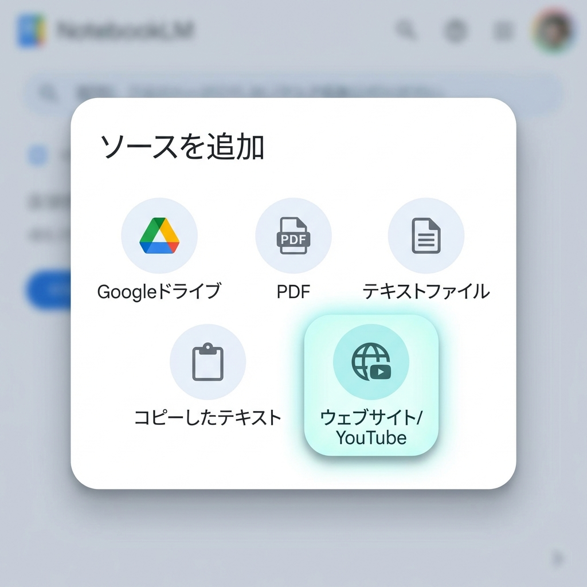
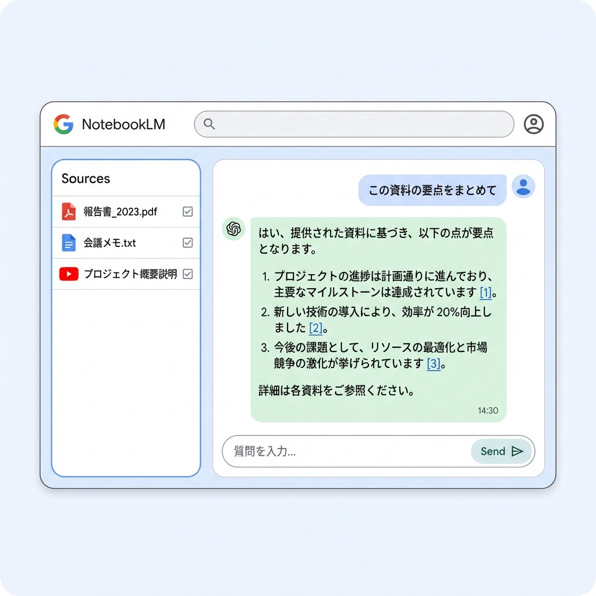

# 1. 導入・基盤：NotebookLMで「組織の知」をAI化する（35分）

## 3行まとめ
* 手持ちの資料（PDF, 動画, URL）だけを読み込ませるから、嘘をつかない「自分専用AI」が作れる。
* YouTube動画も読み込めるので、セミナー動画の要約やQ&Aも一瞬で完成。
* 音声解説（Audio Overview）で、資料の内容をラジオ風に聞き流す新しい学習法も可能。

---

## 研修のねらい
組織内には、実は「活用されていない知識」がたくさん眠っています。過去の報告書、マニュアル、研修動画などです。これらをAI（NotebookLM）に与えることで、必要な情報をいつでも引き出せる「頼れる書記」を育てる方法を学びます。特に、AIの最大の課題である「ハルシネーション（もっともらしい嘘）」を、ソースを限定することで防ぐ手法を習得します。

## ハンズオン: NotebookLMの使い方

### 1. 新しいノートブックを作成する
まずは「ノートブック」という箱を作ります。これが一つのプロジェクト（例：「2026年度事業計画」「新人研修マニュアル」など）になります。

1. [NotebookLM](https://notebooklm.google.com/) にアクセスします。
2. 「新しいノートブックを作成」をクリックします。
3. タイトルを入力します（例：生成AI活用セミナー資料）。

### 2. 資料（ソース）を追加する
ここが一番のポイントです。AIに参照させたい資料を選びます。

*   **Googleドライブ:** 普段使っているドキュメントやスライドを直接選択。
*   **PDF / テキスト:** パソコン内のファイルをアップロード。
*   **ウェブサイト / YouTube:** URLを貼り付けるだけ。**動画の中身まで理解してくれます。**

!!! tip "参考動画を読み込ませてみよう"
    今回の研修の復習として、以下の解説動画をソースに追加してみましょう。
    **[NotebookLM 解説動画](https://youtu.be/xyT8EJ7PG_U?si=9qOBv5rvHtEw9HKa)**
    
    URLをコピーして、「ウェブサイト」→「リンク」に貼り付けるだけで、動画の内容に基づいた回答ができるようになります。

### 3. AIと対話する（チャットQ&A）
資料が入ったら、あとはチャットで質問するだけです。

*   「この動画の要点を3つにまとめて」
*   「初心者にもわかるように、専門用語を解説して」
*   「このマニュアルに基づいて、チェックリストを作って」

回答には必ず **[数字]** の引用マークがつきます。これをクリックすると、「資料のどこを根拠にしたか」が表示されるため、事実確認も安心です。

### 4. 音声解説（Audio Overviews）を試す
資料の内容をもとに、AI2人が対話形式で解説してくれる「音声解説」機能を体験します。
（※現状は英語のみの場合がありますが、日本語対応も順次進んでいます。英語の場合は翻訳ツールと併用して雰囲気を掴みます）

## 活用アイデア
*   **広報担当:** 過去のイベントチラシや報告書を全部入れて、「今年のキャッチコピー案」を出させる。
*   **事務局:** 難解な補助金の公募要領（PDF）を入れて、「申請に必要な書類リスト」や「注意点」を洗い出させる。
*   **学習支援:** 研修動画を読み込ませ用約し、欠席者向けの「5分で読めるレポート」を作成する。

## 成果
*   ✅ 情報源（ソース）に基づいた回答を引き出すことで、AIへの信頼感が定着する。
*   ✅ YouTube動画などの非テキスト情報も、知識ソースとして活用できる技術が身につく。

