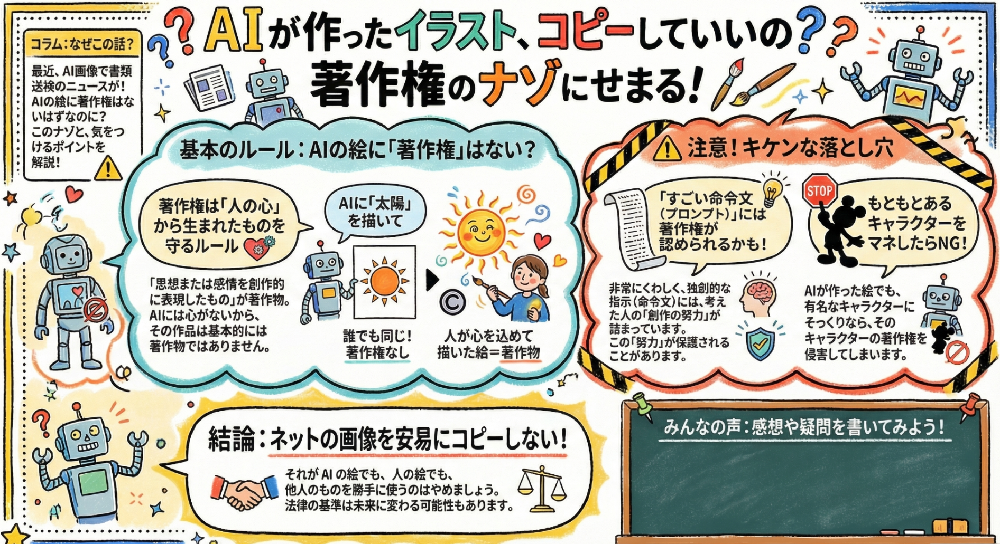
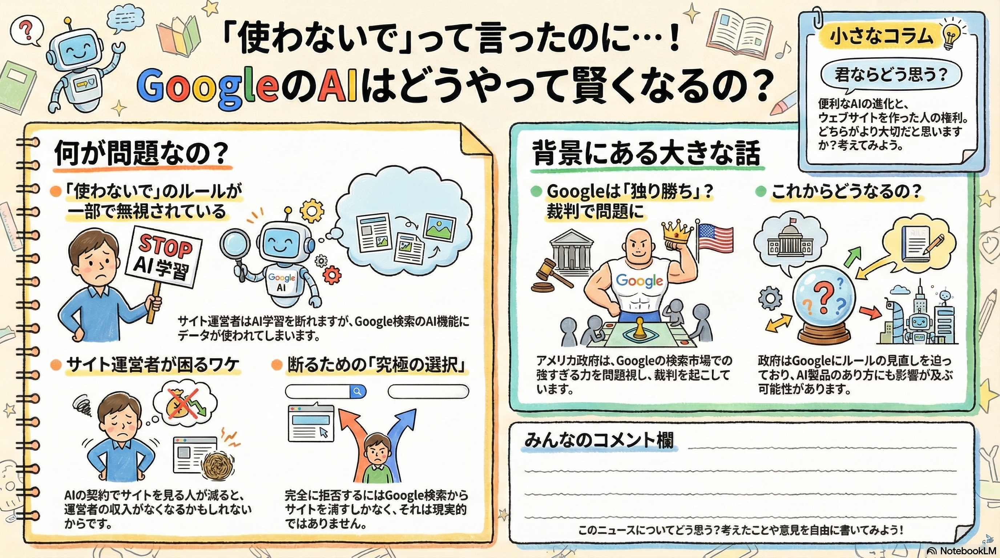

# 2. リスクと倫理：安心して業務に導入するためのリテラシー（20分）

## ねらい
著作権やセキュリティの不安を解消し、安心して導入できる判断軸を持つ。

## 実施内容
- 著作権と商業利用の境界線: AI生成物（画像・音楽）を使う際の判断基準を整理
- 最新の規制動向: 直近1年の法的変化やディープフェイク等の社会問題を理解

## やさしく解説：生成AI画像の著作権
文化庁の整理では、生成AIの画像が「著作物」として保護されるかどうかは**ケースバイケース**で、**人間の創作的な関与がどれだけあるか**がポイントだとされています。  
参考リンク: [日経記事](https://www.nikkei.com/article/DGXZQOUD2067T0Q5A121C2000000/)

## やさしく整理：「なぜディズニーのような著作物がAIに使われてしまうのか」

**という点に絞って、やさしくまとめます。**

### 1. 「過去のデータ」はもう消せない
GoogleなどのAI企業は、いまさら「AIに使わないで」と言われても対応できない問題を抱えています。
- すでに学習済み: ディズニーのような有名なキャラクターは、何十年も前からネット上に大量のデータがあります。AIはこれらをすでに飲み込んで学習してしまっています。
- あとからは消せない: 「これから学習するのはやめて」という設定（オプトアウト）はできますが、すでにモデルの一部になってしまった過去のデータを取り出すことはできないのが現状です。

### 2. 「検索」を人質に取られている状態
サイトの運営者が「自分の作品をAIに使わせたくない」と思っても、Googleの仕組み上、拒否するのが非常に難しくなっています。
- 逃げ道がない: Googleは「AIの学習は拒否できる」と言っていますが、実際にはGoogle検索に載るためのデータが、こっそりAIの回答（AI Overviewsなど）に使われていることを認めています。
- 実質的な強制: AIにコンテンツを使わせない唯一の方法は「Google検索から完全に消えること」です。しかし、検索に出ないということはネット上で誰にも見つけてもらえない（invisible）ことを意味するため、泣く泣くAI利用を許さざるを得ない**「実質的な強制」**が起きています。

### 3. それって著作権違反なの？
ここが一番難しいところですが、資料によると以下の通りです。
- 学習の仕組みの問題: 現在の議論は「勝手に学習したり検索を盾にしたりするGoogleのやり方」に集中しており、アメリカでは司法省が独占禁止法などの観点で裁判を行っています。
- 出力された画像の問題: AIが「そっくりの画像」を出したときに、それが法律的にアウト（著作権侵害）かどうかは、各国の法律やこれからの裁判の判断に委ねられている状態です。

### 一言でいうと
**「Googleは『嫌なら検索から出て行け』という強い立場を使って、実質的に著作物をAIに利用し続けており、著作権者がそれを止めるのは今の仕組みでは非常に難しい」**ということです。

例えるなら、**「広場でパフォーマンスをしたいなら、横にいる似顔絵AIがあなたの芸をじっくり見て学習するのを許可しなさい。嫌なら広場から出て、誰にも見られない山奥でやりなさい」**と言われているような状況です。

- プロンプトが「アイデア程度」にとどまる場合は、著作物性が認められない可能性があります。
- 作品の中にAI生成部分が含まれていても、**そのAI部分には著作権が及ばない可能性がある**一方で、**人が作った部分は保護され得る**と整理されています。
- 判断は個別具体的になるため、**迷ったら「出典の明記」「用途の制限」「権利者への確認」**を基本に進めるのが安心です。

## 成果イメージ
- 組織として「避けるべきリスク」と「使ってよい範囲」を説明できる状態になる
