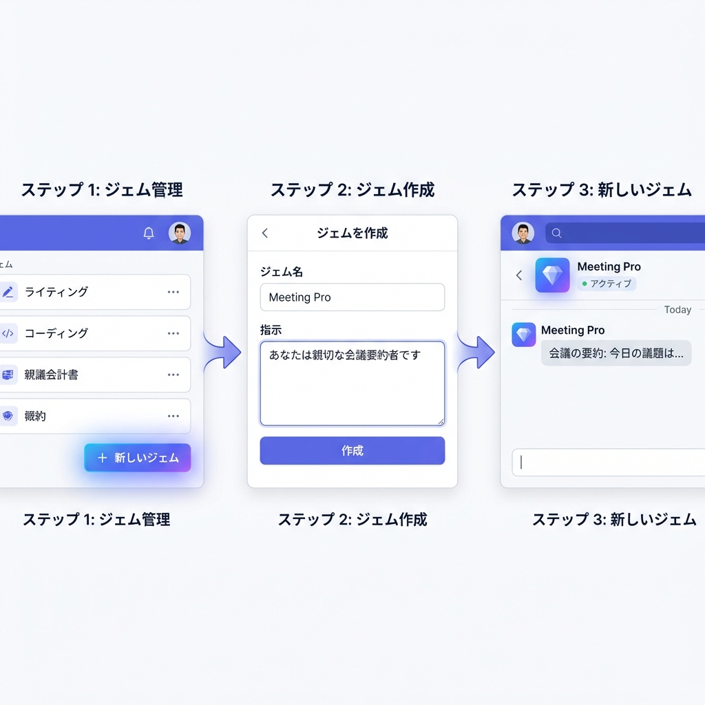
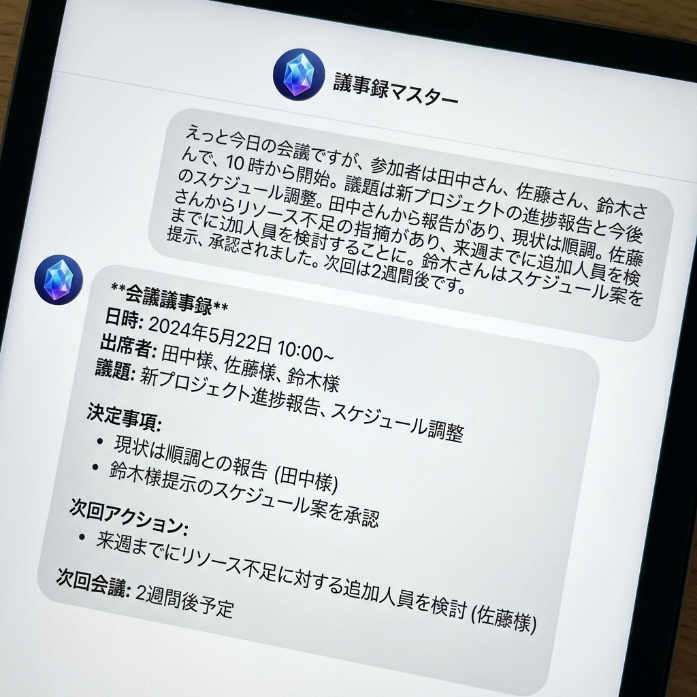

# 3. 実践①：Gemsと最適化ツールによる事務の自動化（30分）

## 3行まとめ
*   「いつも頼むあの仕事」を覚えてくれる自分専用AI（Gems）が誰でも作れる。
*   「議事録係」「事業計画アドバイザー」など、役割ごとにAIを分身させられる。
*   難しい命令文（プロンプト）は不要。やりたいことを伝えるだけでAIが勝手に調整してくれる。

---

## 研修のねらい
毎回「あなたはプロの事務員です。以下の文章を…」と入力するのは手間です。Gemini Gems（ジェム）を使えば、その前提条件や手順を記憶した「専用ボット」を作成できます。これにより、誰が使っても同じ品質で、定型業務を一瞬で完了させる仕組みを作ります。

## ハンズオン: カスタムAI「Gems」の作り方

### 1. Gemsマネージャーを開く
Geminiの画面左側のメニューにある「Gemマネージャー」または「GEM」ボタンをクリックします。

### 2. 新しいGemを作成する
1.  「新しいGemを作成」ボタンを押します。
2.  **名前:** わかりやすい名前をつけます（例：「議事録マスター」「メルマガ執筆係」）。
3.  **指示（ここが重要）:** AIにやってほしいことを具体的に書きます。

> **指示の入力例（議事録マスターの場合）:**
> あなたは優秀な書記です。入力されたメモ書きや音声文字起こしテキストから、以下のフォーマットで議事録を作成してください。
> - 日時
> - 出席者
> - 決定事項（箇条書き）
> - 次回までのタスク（担当者名を入れること）
> 文体は「だ・である」調で統一し、無駄な会話は省いて要点のみをまとめてください。

### 3. マジックワンドで指示を磨く（最適化）
「自分で指示を書くのが難しい」と思っても大丈夫です。ざっくりと要望を書いたあと、きらきらアイコン（✨）のような「最適化ボタン」を押してみてください。
AIが「よりAIに伝わりやすい形」に指示文を自動で書き直してくれます。

### 4. 試して保存する
右側のプレビュー画面でテストしてみましょう。例えば、適当な会議メモを貼り付けてみます。
意図通りの形式で返ってきたら「作成」を押して保存完了です。

## 活用アイデア
*   **イベント企画壁打ちGem:** 「ターゲットは親子連れ」などと入れると、過去の事例（知識ベース）を踏まえて企画案を5つ出してくれる。
*   **補助金申請チェックGem:** 申請書の下書きを貼り付けると、「審査員視点」で不備や説得力の弱い部分を指摘してくれる。
*   **SNS広報Gem:** 活動報告の箇条書きを入れるだけで、「Instagram用（ハッシュタグ多め）」と「Facebook用（丁寧な文章）」の2パターンを出力する。

## NotebookLMとの違いは？
*   **NotebookLM:** 「この**資料**について教えて」。資料の分析・理解が得意。
*   **Gems:** 「この**役割**で仕事をして」。定型作業のこなし・ツールの作成が得意。

これらを使い分けることで、業務効率は何倍にも加速します。

