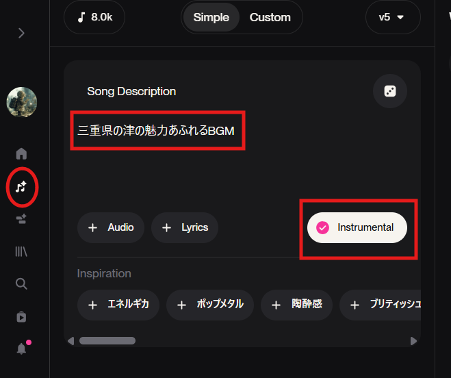
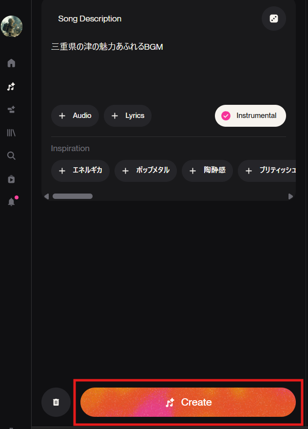
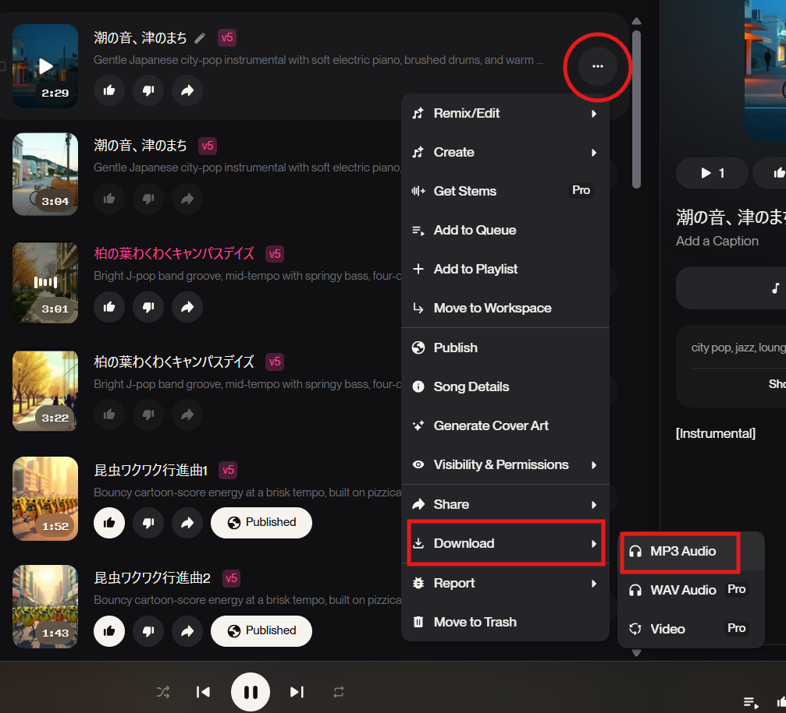

# 4. 実践②：Suno AIで「BGM・イメージソング」を作成（25分）

## 3行まとめ
*   「Instrumental」スイッチを入れるだけで、プロ級のBGMが歌詞なしで作れる。
*   イベントの待ち時間やYouTube動画の背景音楽（BGM）を、権利問題を気にせず用意できる。
*   雰囲気を言葉で伝えるだけ。作曲知識は一切不要。

---

## 研修のねらい
地域イベントや活動報告動画で、「いい感じの音楽」を使いたいけれど、市販のCDは著作権が心配…という悩みは尽きません。音楽生成AI「Suno AI」を使えば、その場にぴったりのオリジナルBGMを数分で作成できます。

## ハンズオン: イベント用BGMの作り方

### 1. 「Create」画面を開く
[Suno](https://suno.com/) にアクセスし、左メニューの「Create」をクリックします。
画面上部の「Simple」を選びまず。

### 2. 「Instrumental」をONにする（重要）
**ここが最大のポイントです。**
歌詞（Lyrics）のないBGMを作りたいときは、必ず **「Instrumental」をON** にします。
これを忘れると、いきなりAIが歌い出してしまいます。

### 3. 曲のイメージを入力する
「Style of Music」欄に、欲しい曲の雰囲気を英語（または日本語）で入力します。

> **おすすめのプロンプト例:**
> *   **地域の魅力** `三重県の津の魅力あふれるBGM`
> *   **カフェ風:** `Relaxing piano, BGM for cafe, warm atmosphere`
> *   **イベント開始前:** `Upbeat pop, exciting, opening ceremony`
> *   **和風:** `Traditional Japanese instruments, koto, shamisen, peaceful`

### 4. Createボタンで作成
「Create」ボタンを押します。一度に2曲のバリエーションが生成されます。

### 5. 試聴とダウンロード
気に入った曲ができたら、右側の「Download」ボタンから保存します。
*   **Audio:** MP3形式などで音声のみ保存（BGM用途ならこちら）
*   **Video:** ジャケット画像付きの動画として保存（そのままSNSに投稿する場合など）

## トラブルシューティング
*   **Q. 曲が短すぎる（2分くらいで終わる）**
    *   A. 「Extend（拡張）」機能を使います。曲の続きを作りたい位置（通常は最後）を指定し、そこから先を継ぎ足すことができます。
*   **Q. 権利は大丈夫？**
    *   A. 有料プラン（Pro/Premier）に加入している期間に作った曲は、**商用利用が可能**です。イベントで流したり、収益化しているYouTubeに使用したりできます。無料プランの場合は非営利目的（個人のSNSなど）に限られますが、地域活動（非営利）での利用範囲についてはSunoの最新規約を都度確認することをお勧めします。

## 成果
*   ✅ 著作権フリー（商用可プラン時）のオリジナルBGMを自力で調達できるようになる。
*   ✅ 「カフェ風」「運動会風」など、シーンに合わせた選曲が自在になる。
