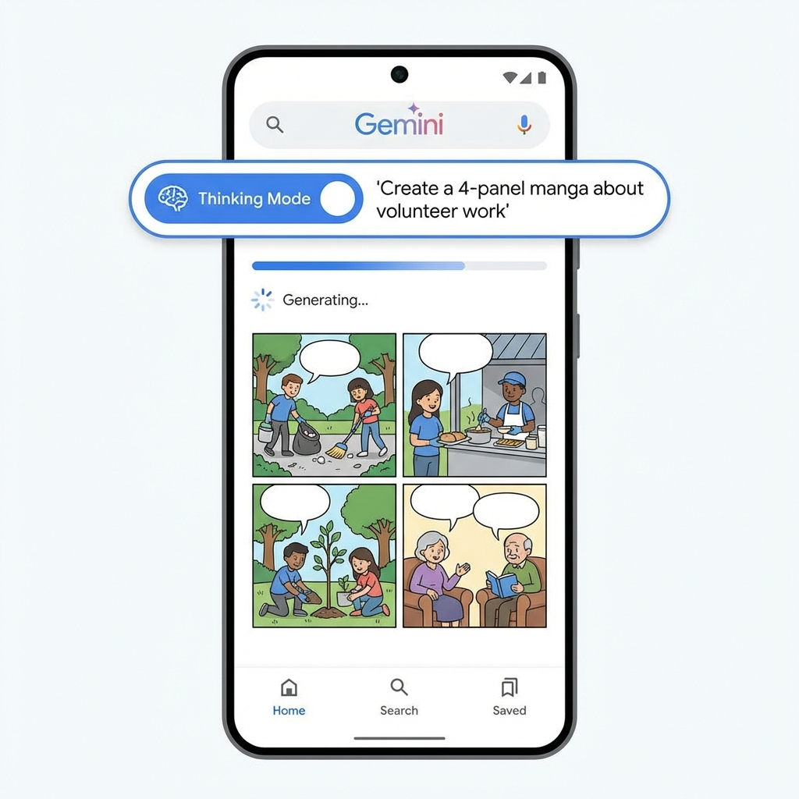
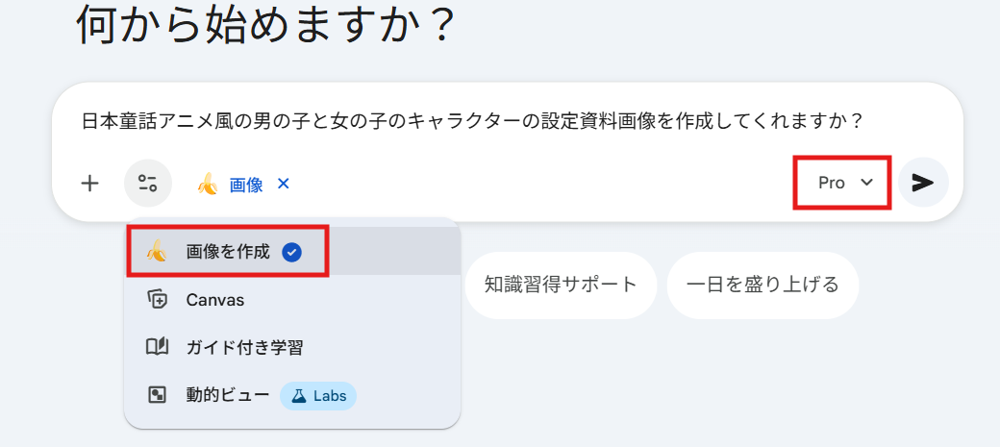
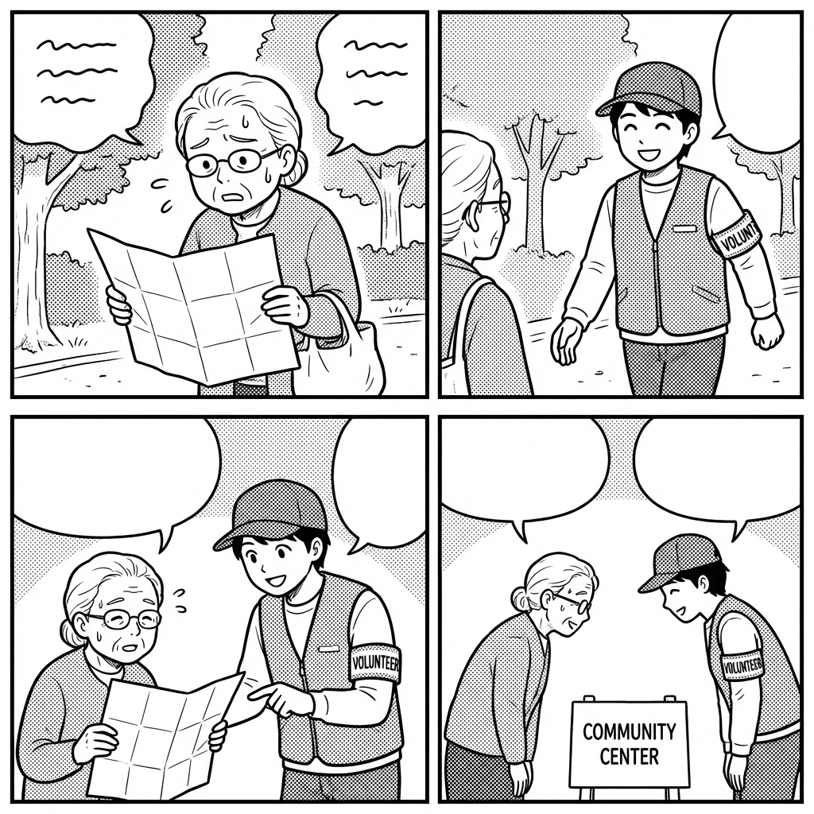

# 5. 実践③：Nano Banana Proによる視覚的広報の革新（25分）

## 3行まとめ
*   「Nano Banana Pro（Gemini 3 Pro Image）」は、ついに日本語の文字も正しく描けるようになった。
*   「4コマ漫画を描いて」の一言で、ストーリー作成から作画まで全自動。
*   難しい福祉の制度や活動報告を、親しみやすい漫画にして伝えられる。

---

## 研修のねらい
これまで、画像生成AIは「指がおかしい」「謎の文字が入る」といった弱点があり、広報には使いづらい側面がありました。最新のGoogleモデル（開発コード名: Nano Banana Pro / 正式名: Gemini 3 Pro Image）は、これらの弱点を克服し、**「チラシに使えるレベル」**の文字入り画像や図解を作成できます。

## ハンズオン: Geminiで4コマ漫画を作る
難しい制度の説明や、ボランティア募集の呼びかけを、親しみやすい「4コマ漫画」にしてみましょう。
参考リンク: [Gemini](https://gemini.google.com/app?hl=ja)

### 1. Geminiで「思考モード」にする
最新の描画能力を引き出すため、Geminiの設定を確認します。モバイル版やWeb版で「思考プロセス（Thinking Mode）」などが利用可能な場合はONにします（※Gemini Advanced等、利用環境による）。

### 2. プロンプトを入力する
まずは漫画のキャラの設定資料画像を作成します（例：三面図や表情差分）。

以下の構成で指示を出すと、驚くほど高品質な漫画が生成されます。

> **プロンプト例：**
> 以下の条件で、日本の4コマ漫画を作成してください。
>
> **テーマ:** 高齢者が地域のボランティアに助けられる心温まる話
> **スタイル:** 白黒の漫画スタイル、スクリーントーンあり、手書き風
> **台詞:**
> 1コマ目: おばあちゃんが道に迷って困っている（「ここはどこかのう…」）
> 2コマ目: 若いボランティアが笑顔で声をかける（「どうしました？」）
> 3コマ目: 地図を見ながら親切に案内する
> 4コマ目: おばあちゃんが笑顔でお礼を言う（「ありがとう、助かったよ」）

### 3. 生成結果を確認・修正する
数十秒で、コマ割りされた画像が出力されます。

*   **気に入らない場合:** 「もう少し絵柄を可愛くして」「3コマ目をアップにして」とチャットで追加指示を出せば、何度でも描き直してくれます。

### 4. 広報誌やSNSに活用する
出来上がった画像は保存して、そのまま広報誌の挿絵や、SNSの投稿に使えます。
「文字が崩れている」場合は、Canvaなどの編集ソフトで吹き出しの中に正しい文字を入れ直すと、より完璧な仕上がりになります。

## 応用テクニック: 一貫性のあるキャラクター
「このキャラクター（例：ミエちゃん）を広報部長にしたい！」という場合。
1.  最初にキャラクターの設定画を作らせる（「福祉協議会のマスコットキャラクター、猫耳パーカーの女の子、三面図」）。
2.  その画像をGeminiに読み込ませ、「このキャラクターが掃除をしている絵を描いて」と指示する。
これで、同じ顔のキャラクターで色々なシーンのイラストを量産できます。

## 成果
*   ✅ 文章だけでは読まれない情報を、漫画や図解で「見てもらえる情報」に変えられる。
*   ✅ イラストレーターに依頼する予算や時間がなくても、担当者自身で高品質な素材を作れる。
