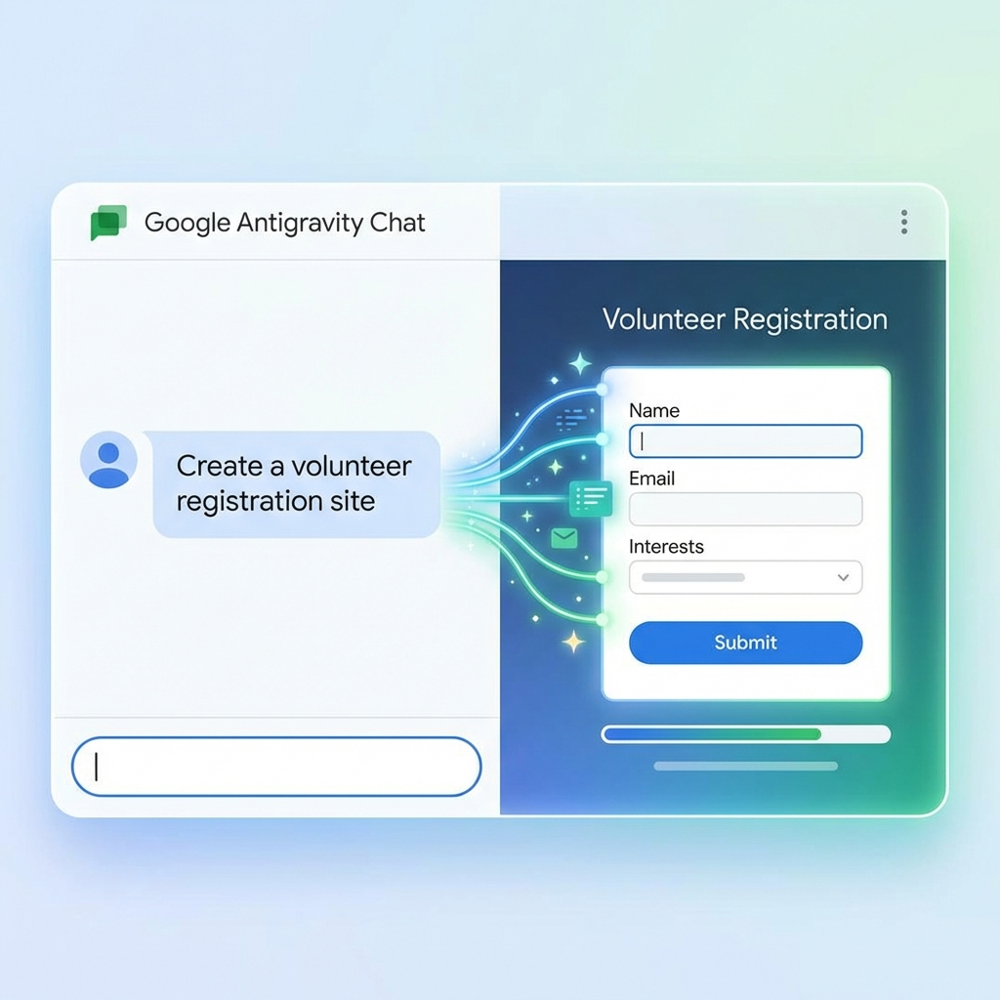
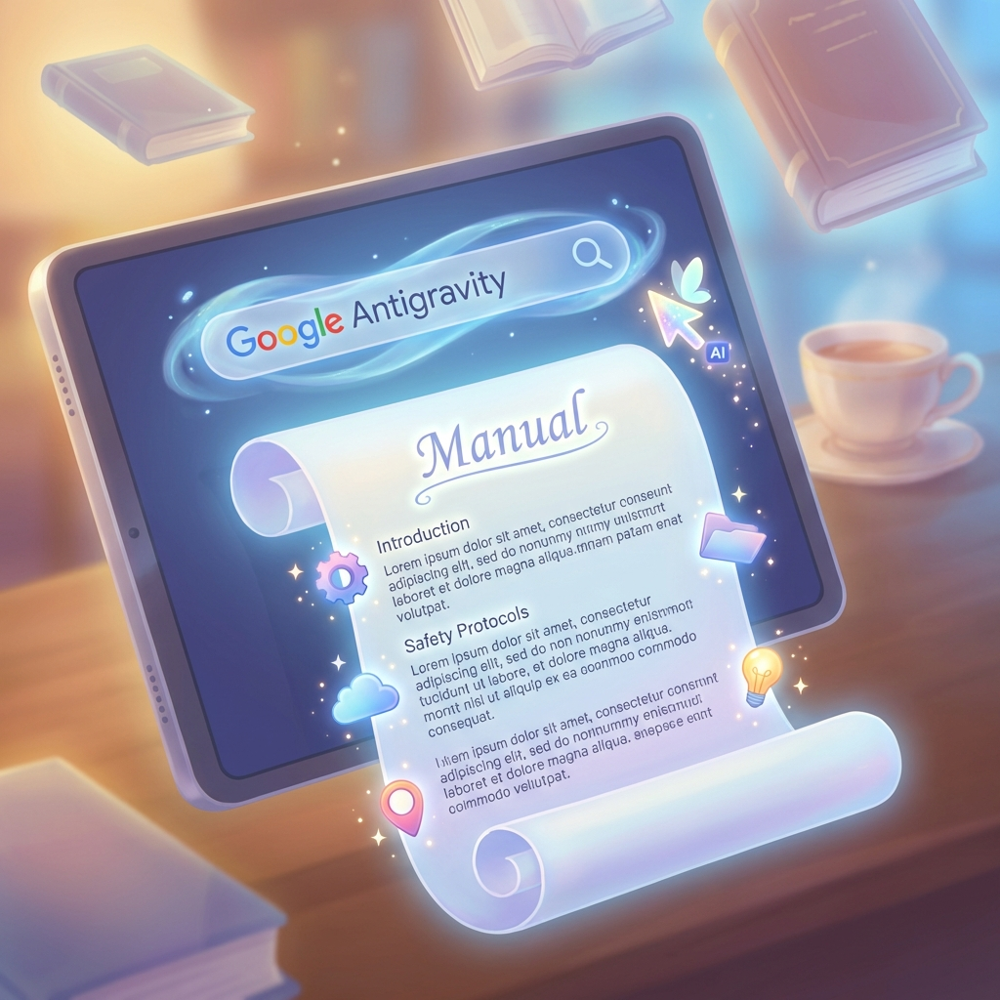

# 7. 発展：Google AntigravityによるWeb・マニュアル自動作成（15分）

## 3行まとめ
*   「こんなサイトが欲しい」とチャットするだけで、数秒後には目の前でアプリが動いている。
*   文字を書くのも、絵を描くのも、全部AIにお任せ。「完全自動」でマニュアルが出来上がる。
*   プログラミング知識はゼロでOK。必要なのは「やりたいこと」を伝える熱意だけ。

---

## 研修のねらい
生成AIの進化は、「文章を作る」「絵を描く」という単体の作業から、それらを組み合わせて「一つの成果物（Webサイトや冊子）を作り切る」フェーズに突入しています。Google Antigravity（アンチグラビティ）という最新技術を通じて、**「人間は指示を出し、AIが手を動かす」未来の働き方**をいち早く体験します。

## 実施内容: AIとペアプログラミング体験

### 1. 対話だけでアプリ開発
普通、Webサイトやアプリを作るには、難しいコード（HTMLやPythonなど）を書く必要があります。しかし、Antigravityならチャットで話しかけるだけです。

「地域のボランティア登録フォームを作って。名前と連絡先、活動希望日を入力できるようにして」

そう伝えると、AIがその場でコードを書き、一瞬で動く画面を見せてくれます。

*   **気に入らなければ直してもらう:** 「もう少し明るい色にして」「住所の欄も足して」と言えば、即座に修正されます。
*   **公開も簡単:** その場でリンクを発行し、みんなに使ってもらうことも可能です。

### 2. 画像付きマニュアルも一瞬で
マニュアル作りで一番大変なのは、「わかりやすい図を用意すること」と「レイアウト」です。Antigravityは、文章を書きながら、その文脈に合ったイラストを**自動的に生成して配置**します。

「ボランティアの心得マニュアルを作って。画像付きでわかりやすく」

これだけで、見出し、本文、そして必要な挿絵（例：笑顔で挨拶するイラスト、注意点の図解など）が魔法のように現れ、一つのドキュメントとして完成します。

## この技術で変わること
*   **「技術がないから無理」がなくなる:** アイデアさえあれば、誰でも形にできるようになります。
*   **スピード革命:** 3日かかっていた資料作成が、30分で終わるようになります。
*   **創造性への集中:** 事務作業はAIに任せ、人間は「どんな活動をすれば地域が良くなるか」という企画や対話に時間を割けるようになります。

## 成果イメージ
*   参加者が「AIを使えば、自分たちの活動をもっと広く、深く伝えられる」という確信とワクワク感を持って研修を終える。
